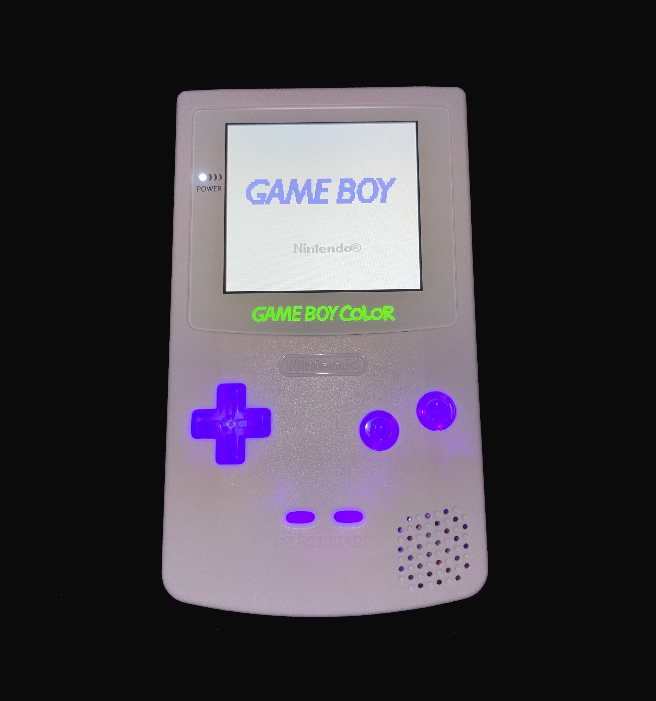
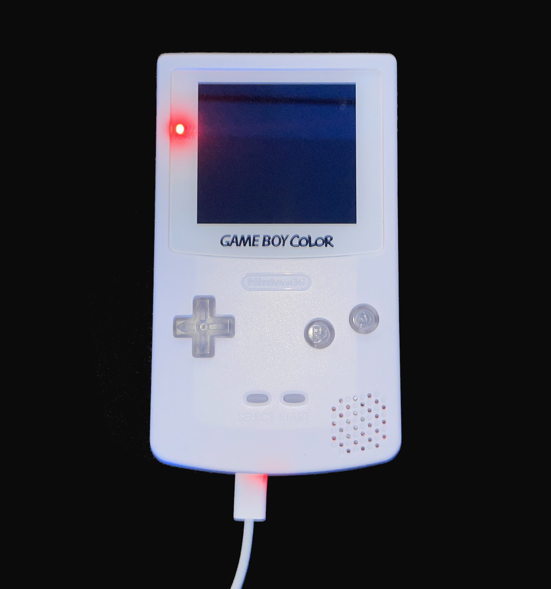
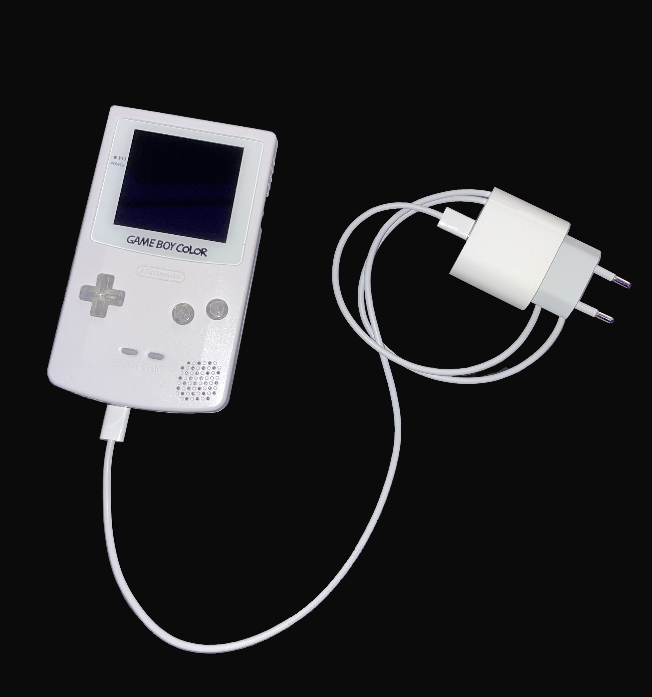
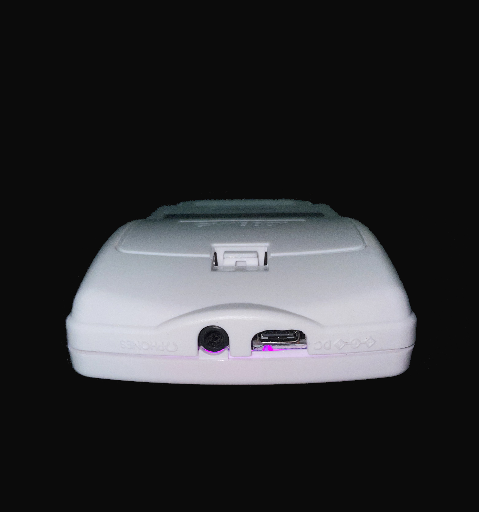
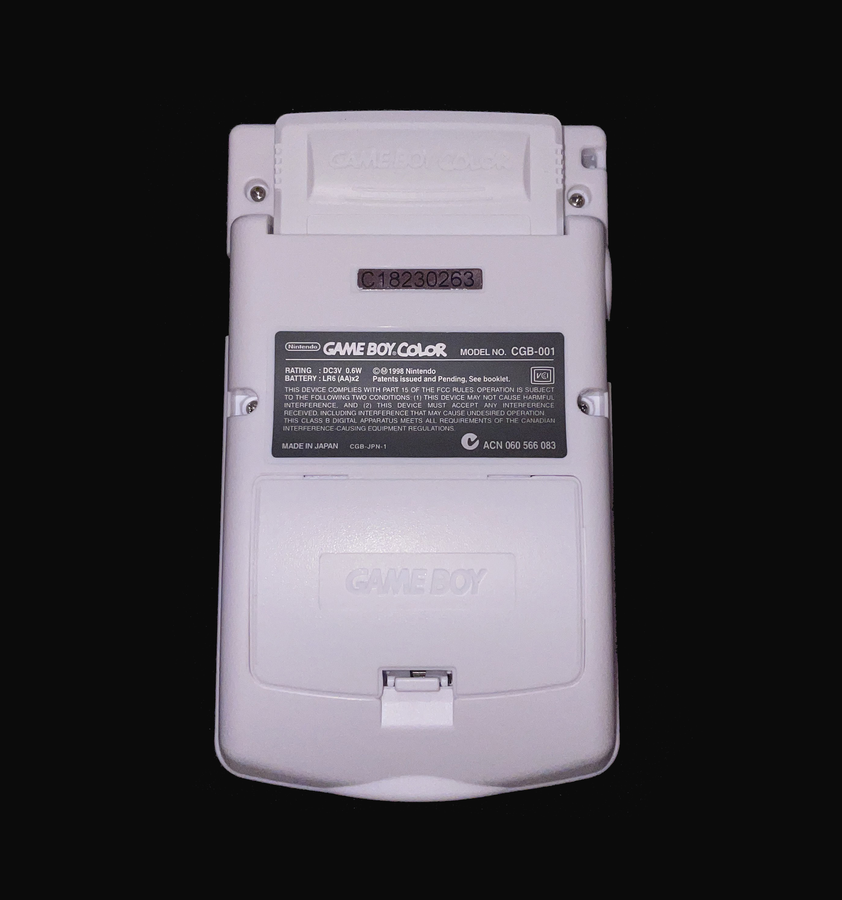

# GameBoy-Color Mod

With this Mods your old stinky GameBoy-Color will shine in new glory like a diamand.

- Charge-Port: USB-C
- Battery-Life: 8 Hours
- Recharging: 1 Hour

## Table of Contents

- [Material list](docs/materials.md)
- [Modding Steps](docs/steps.md)
- [Controls](docs/controls.md)

## Preview

    
    

    
    

    
    

### What's new
- Recharable Battery
- Bright and Bigger Display
- USB-C Charging
- LED Buttons

# Total  
- Cost: 150$
- Time: 8 Hours 
- Fun: ∞
- noob friedly project (etwas für Nico)
- difficulty: 4/10

